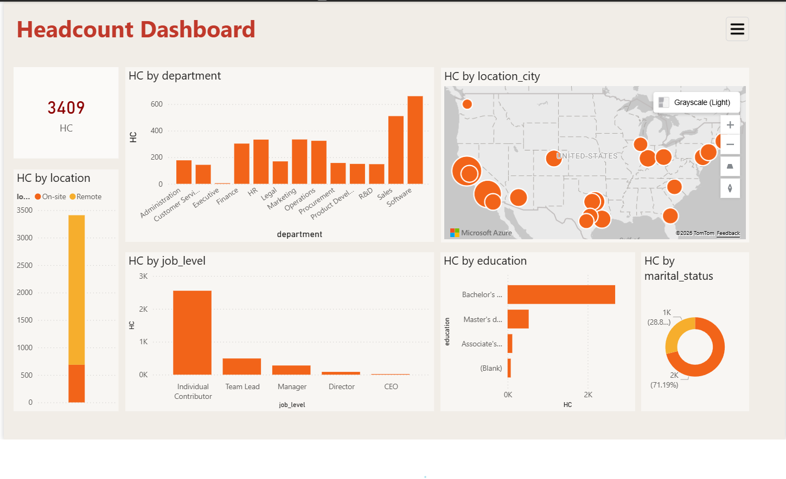
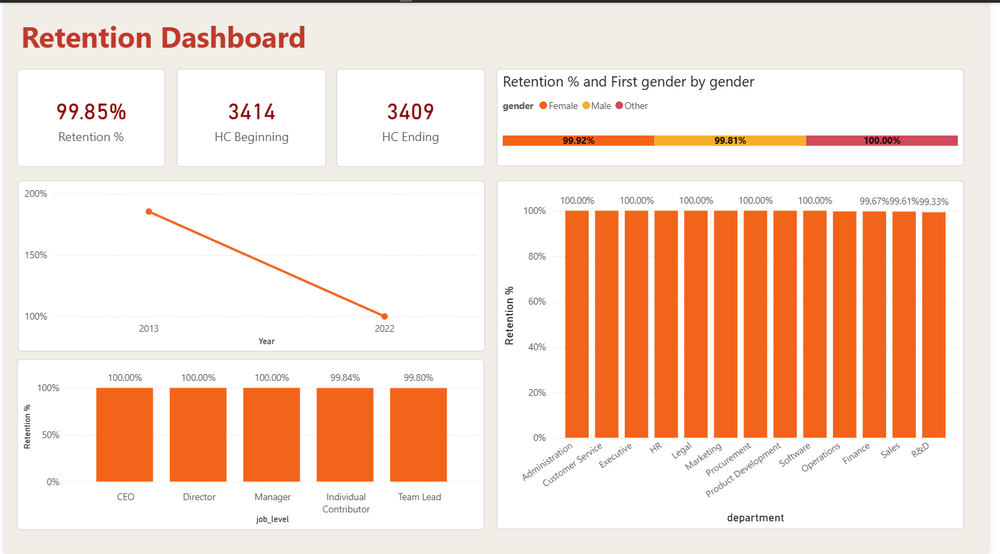
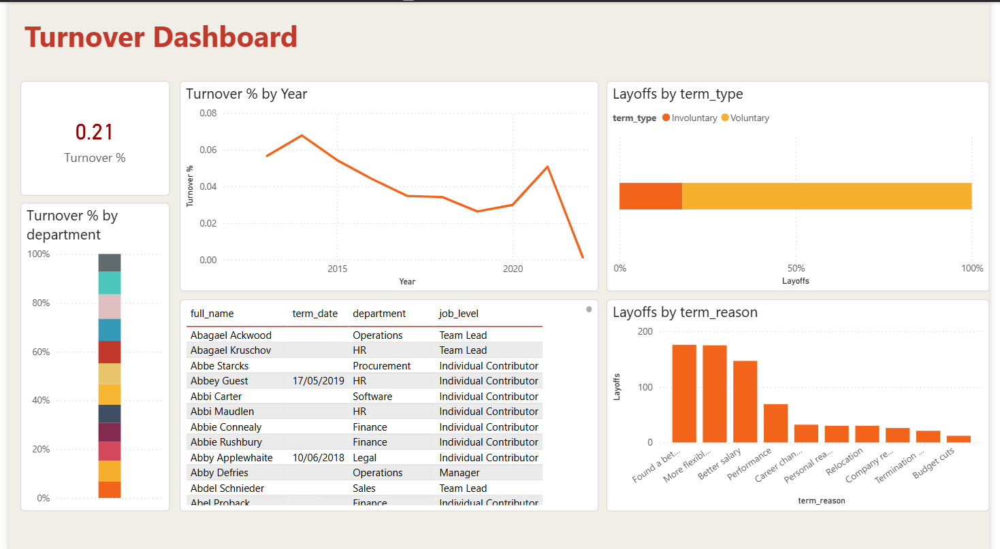
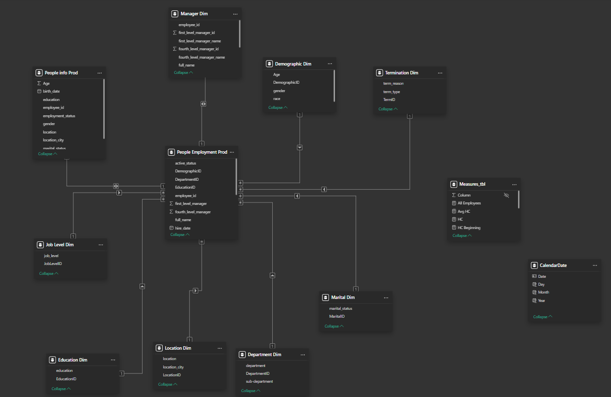

# Advanced HR Data Modeling & Analytics Dashboard

**Power BI** | **Modélisation en Star Schema** | **Headcount • Retention • Turnover**

## 📋 Contexte du Projet

Ce projet présente une analyse RH avancée pour une entreprise américaine.  
À partir de deux fichiers CSV bruts (`people_employment.csv` et `people_data.csv`), j’ai conçu une **modélisation en étoile (Star Schema)** complète avec **une table de faits** et **9 tables de dimensions**.

Le dashboard interactif permet de suivre en temps réel :
- Le **Headcount** (effectif)
- La **Retention** des employés
- Le **Turnover** et les départs (volontaires / involontaires)

## 🎯 Objectifs

- Transformer deux fichiers plats en un modèle de données propre et performant
- Créer un schéma en étoile professionnel (1 Fact + 9 Dimensions)
- Développer des mesures DAX avancées (Headcount, Retention %, Turnover %, etc.)
- Fournir des dashboards interactifs pour le suivi RH stratégique

## 🛠️ Données Sources

- **people_employment.csv** : Informations emploi (département, job level, salary, managers, term_date, term_reason…)
- **people_data.csv** : Informations démographiques (genre, race, éducation, statut marital…)

## 📊 Modélisation des Données (Star Schema)

**1 Table de Faits :**
- `People Employment Prod` (Fact Table)

**9 Tables de Dimensions :**
- CalendarDate (Dimension Temps)
- Demographic Dim
- Department Dim
- Education Dim
- Job Level Dim
- Location Dim
- Manager Dim
- Marital Dim
- Termination Dim

## 📈 Dashboards Développés

### 1. Headcount Dashboard
- Effectif total : **3 409** employés
- Répartition par département, ville, niveau hiérarchique et éducation
- Carte géographique des effectifs aux États-Unis
- Répartition On-site vs Remote

### 2. Retention Dashboard
- Taux de rétention global : **99.85 %**
- Évolution de la rétention sur les années
- Taux de rétention par genre, département et niveau hiérarchique

### 3. Turnover Dashboard
- Taux de turnover global : **0.21 %**
- Évolution du turnover par année
- Analyse des départs (Voluntary vs Involuntary)
- Raisons principales de départ (table + graphique)
- Liste détaillée des employés ayant quitté l’entreprise

## 🔑 Mesures DAX Principales

- Headcount (début/fin de période)
- Retention %
- Turnover %
- Retention Slope
- Salary Highlights
- Layoffs Count
- etc.

## 💡 Insights Clés

- L’effectif est fortement concentré dans quelques départements (Software, Sales, R&D…).
- Le taux de rétention est excellent (> 99.8 %), avec une légère baisse sur les dernières années.
- Le turnover reste très bas, majoritairement **volontaire**.
- La majorité des employés sont au niveau **Individual Contributor**.
- Forte concentration géographique sur la côte ouest et est des États-Unis.

## 🔗 Fonctionnalités Avancées

- Modélisation Star Schema optimisée
- Mesures DAX complexes et commentées
- Utilisation de Bookmarks pour navigation fluide entre les 3 dashboards
- Carte géographique interactive
- Drill-through et Cross-report
- Mise en forme conditionnelle et visuels cohérents

---

**Auteur :** Hamza KHIAR  
**Date :** Avril 2026  
**Outil :** Power BI Desktop  
**Portfolio Data Analyst**
